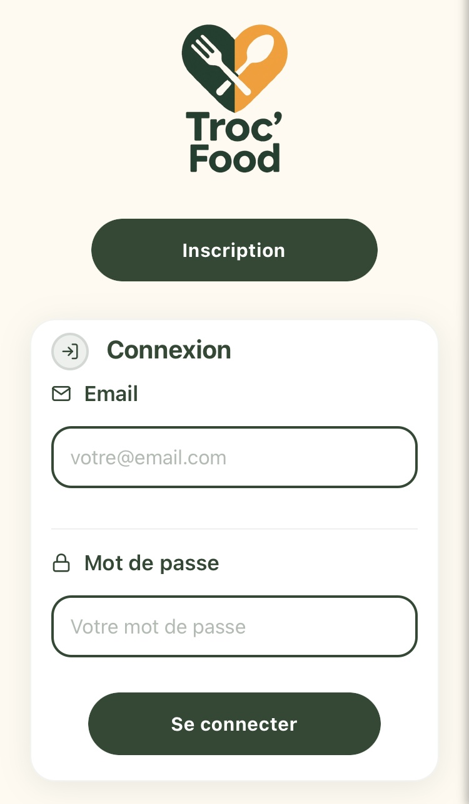
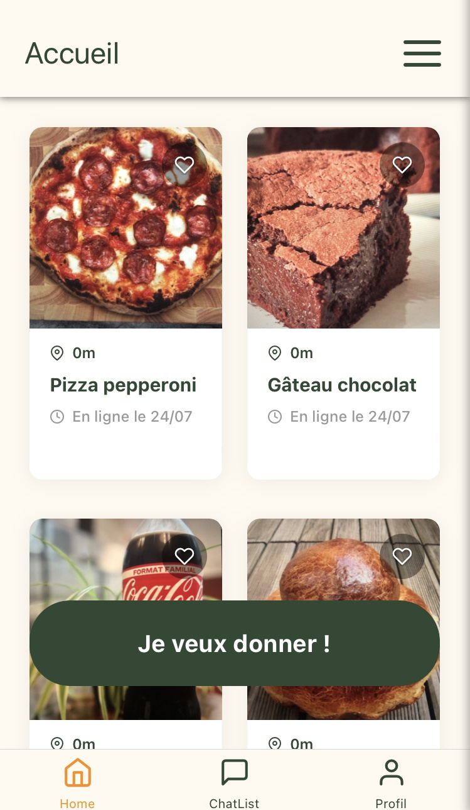
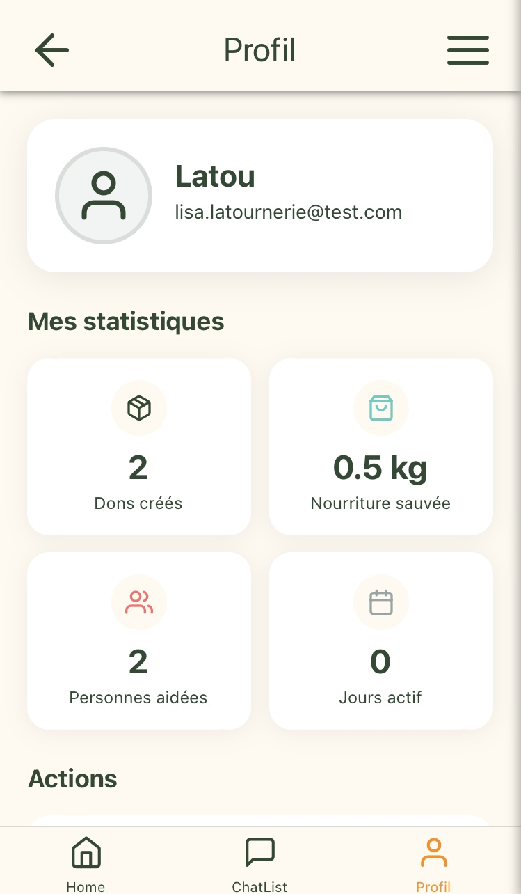

# Troc'Food

Troc'Food est une application mobile de partage et de réservation de dons alimentaires entre particuliers. Elle vise à lutter contre le gaspillage alimentaire en facilitant la mise en relation entre donneurs et bénéficiaires.

<div align="center">
  
  
  
</div>

## 🚀 Stack Technique

### Frontend (Mobile)

- **React Native** (Expo)
- **Redux Toolkit** (gestion d’état)
- **React Navigation** (navigation multi-écrans)
- **React Native Vector Icons** (icônes)
- **Expo Location** (géolocalisation)
- **Expo Camera** (prise de photo)
- **Cloudinary** (hébergement d’images)
- **Pusher** (messagerie temps réel)
- **API Adresse.data.gouv.fr** (suggestion d’adresses)

### Backend (API REST)

- **Node.js** (Express)
- **MongoDB** (Mongoose)
- **Cloudinary** (upload images)
- **Pusher** (websocket chat)
- **bcrypt** (hashage mots de passe)
- **Moment.js** (gestion des dates)
- **Dotenv** (variables d’environnement)

## 📱 Fonctionnalités principales

- Inscription / Connexion sécurisée
- Création et édition de profil utilisateur
- Ajout, modification et suppression de dons
- Upload de photos pour chaque don
- Recherche de dons par géolocalisation
- Favoris (sauvegarde de dons)
- Messagerie temps réel entre utilisateurs
- Confirmation de réservation et de réception
- Statistiques personnelles (dons créés, favoris, etc.)

## 🗂️ Structure du projet

```text
Troc'Food_Appli/
├── backend/
│   ├── models/         # Schémas Mongoose (User, Don, Message, etc.)
│   ├── routes/         # Routes Express (users, dons, chat, favorites)
│   ├── modules/        # Fonctions utilitaires (validation, etc.)
│   ├── app.js          # Point d’entrée serveur
│   └── .env            # Variables d’environnement backend
└── frontend/
    ├── components/     # Composants réutilisables (DonCard, etc.)
    ├── reducers/       # Redux slices
    ├── screens/        # Écrans principaux (Home, Chat, Profile, etc.)
    ├── assets/         # Images et icônes
    ├── App.js          # Navigation principale
    └── .env.local      # Variables d’environnement frontend
```

## 🔒 Sécurité & bonnes pratiques

- Les mots de passe sont hashés avec bcrypt.
- Les tokens utilisateurs sont générés et utilisés pour l’authentification.
- Les données sensibles (Cloudinary, Pusher, MongoDB URI) sont stockées dans des fichiers .env non versionnés.

## ✨ Points forts techniques

- Architecture modulaire : séparation claire frontend/backend, composants réutilisables.
- Expérience utilisateur : navigation fluide, feedback visuel, gestion des erreurs.
- Temps réel : chat instantané grâce à Pusher.
- Mobile first : design responsive et adapté à différents écrans.
- Utilisation d’API publiques : suggestion d’adresses, géolocalisation.

## 👤 Auteurs

- Margaux Courageux, Omar Dahmani, Manon Dubois, Florian Marie, Lisa Latournerie
- GitHub : https://github.com/lisalatou
- Projet réalisé en tant que Minimum Viable Product dans l'objectif de l'obtention u titre de Concepteur Développeur d’Application Web et Mobile
